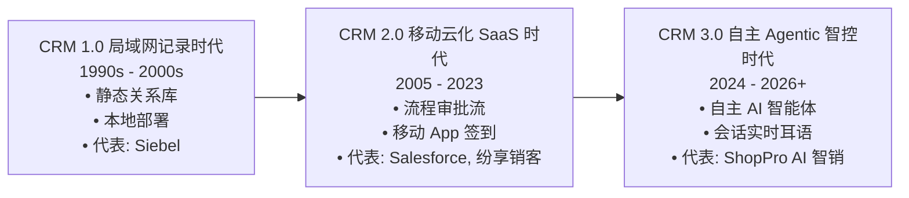

# 🚀 ShopPro AI 智销 —— 项目说明书与商业计划书 (Business Plan & Product Whitepaper)

> **定位**：下一代自主型 AI 销售智能体中枢与收入运营平台 (Agentic AI CRM & Revenue Intelligence Platform)  
> **核心使命**：将传统“事后记录型”CRM 颠覆为“自主协同、前瞻预测、确定成单”的 AI 增长新引擎  
> **版本**：v2.0 Enterprise Edition | 编制日期：2026 年

---


---

## 📑 目录索引

- [执行摘要 (Executive Summary)](#-执行摘要-executive-summary)
- [Page 1: 行业现状与宏观范式变革](#page-1-行业现状与宏观范式变革-industry-landscape)
- [Page 2: 市场痛点与企业真实绝症](#page-2-市场痛点与企业真实绝症-market-pain-points)
- [Page 3: ShopPro 解决方案与技术架构全景](#page-3-shoppro-解决方案与技术架构全景-solution--architecture)
- [Page 4: 核心产品能力与四大智能体矩阵](#page-4-核心产品能力与四大智能体矩阵-core-capabilities--agents)
- [Page 5: 竞品全景对标与核心竞争壁垒](#page-5-竞品全景对标与核心竞争壁垒-competitive-benchmark)
- [Page 6: 双端极致体验与标杆行业落地场景](#page-6-双端极致体验与标杆行业落地场景-dual-end-ui--use-cases)
- [Page 7: 商业模式、阶梯定价与 ROI 投资回报测算](#page-7-商业模式阶梯定价与-roi-投资回报测算-business-model--roi)
- [Page 8: 发展历程与未来战略路线图](#page-8-发展历程与未来战略路线图-roadmap--milestones)

---

## 💡 执行摘要 (Executive Summary)

ShopPro AI 智销针对现代企业销售过程中“**数据录入抗拒、商机黑盒流失、销售经验断层、营收预测失准**”四大痛点，构建了业内领先的 **自主型 AI 智能体流水线 (Agentic Pipeline) 与收入运营引擎 (Revenue Intelligence)**。

系统不仅打通了从「线索接入 ➔ 行为捕获 ➔ 智能首触 ➔ 通话辅导 ➔ 管道推进 ➔ 签约赢单」的全生命周期闭环，更实现了 **SDR 智能体自主首触**、**会话毫秒级耳语辅导**、**动态多因子成单胜率测算** 与 **实时行为信号 <15min 极速响应**。

```
┌────────────────────────────────────────────────────────────────────────────────────────┐
│                               ShopPro AI CRM 核心商业价值指标                          │
├──────────────────────┬──────────────────────┬───────────────────┬──────────────────────┤
│ 销售首触时效提升      │ 线索流失率降低        │ 平均成单胜率提升  │ 客户投资回报周期     │
│ ⚡ 60% ↑            │ 📉 45% ↓            │ 🎯 +4.2% ~ +8.5%  │ ⏱️ 仅 2.4 个月       │
└──────────────────────┴──────────────────────┴───────────────────┴──────────────────────┘
```

---

## Page 1: 行业现状与宏观范式变革 (Industry Landscape)

### 1.1 CRM 发展的三次代际跃迁

企业级销售软件正在经历自上世纪 90 年代以来的第三次代际革命：



### 1.2 传统 CRM 的根本缺陷与行业变革机遇
- **销售精力被严重挤占**：根据 Gartner 与 Salesforce 行业调研，现代 B2B 销售人员**仅有 35% 的工作时间用于直接与客户沟通**，剩余 65% 的时间耗费在繁琐的数据手工录入、文档制作与内部流程流转上；
- **AI 范式转移**：大模型（LLM）与多智能体（Multi-Agent System）技术的成熟，使 CRM 从过去的“被动数据仓库”演进为能够“自主分析、主动撰写、实时提醒、闭环执行”的数字销售副驾驶。

---

## Page 2: 市场痛点与企业真实绝症 (Market Pain Points)

企业销售业绩增长面临四大不可逾越的“管理绝症”：

```
┌──────────────────────────────────────────────────────────────────────────────────────────┐
│                               传统企业销售团队的四大核心痛点                              │
├──────────────────────────┬───────────────────────────────────────────────────────────────┤
│ 1. 录入负担重，数据失真严重│ 销售天然抗拒填写 CRM，跟进记录靠应付，导致企业客户资产严重失真│
├──────────────────────────┼───────────────────────────────────────────────────────────────┤
│ 2. 商机推进是“黑盒”     │ 管理者无法洞察沟通细节，卡单原因不透明，季度业绩预测全靠“拍脑袋”│
├──────────────────────────┼───────────────────────────────────────────────────────────────┤
│ 3. 销售能力断层，无法复制│ 销冠经验依赖个人悟性，新人带教周期长达 3-6 个月，优秀话术无法沉淀│
├──────────────────────────┼───────────────────────────────────────────────────────────────┤
│ 4. 关键意向信号响应滞后  │ 客户查看报价单、下载配置表等黄金跟进时机流失在系统死日志中    │
└──────────────────────────┴───────────────────────────────────────────────────────────────┘
```

---

## Page 3: ShopPro 解决方案与技术架构全景 (Solution & Architecture)

ShopPro 提出「**感知 (Perception) ➔ 思考 (Reasoning) ➔ 决策 (Decision) ➔ 协同 (Action) ➔ 归因 (Attribution)**」的全链路闭环架构。

```mermaid
graph TD
    subgraph 1_感知与接入层 [1. 接入感知层]
        In1[全渠道线索池 / 渠道活码]
        In2[实时客户行为捕获 (停留/浏览)]
        In3[通话录音与实时音频流]
    end

    subgraph 2_AI大脑与调度中心 [2. AI 认知与场景调度引擎]
        M1[多大模型统一接入网关]
        M2[7大业务场景动态路由]
        M3[知识库 RAG 语义检索]
        M4[多因子动态胜率测算算法]
    end

    subgraph 3_智能体流水线 [3. AI 销售智能体协同流水线]
        A1[🤖 SDR 自动首触智能体]
        A2[🤖 逾期跟进激活智能体]
        A3[🤖 Deal Coach 成单教练]
    end

    subgraph 4_业务工作台 [4. 双端业务生产力工作台]
        UI1[🖥️ PC 端高密度工作台 (深浅主题)]
        UI2[📱 移动端 AI 协同 App (iOS/Android)]
    end

    In1 & In2 & In3 --> M1 & M2 & M3 & M4
    M1 & M2 & M3 & M4 --> A1 & A2 & A3
    A1 & A2 & A3 --> UI1 & UI2
```

---

## Page 4: 核心产品能力与四大智能体矩阵 (Core Capabilities & Agents)

ShopPro 构建了业内领先的 **4 大战略级 AI 能力矩阵**：

### 4.1 🤖 AI 销售智能体协同流水线 (Agentic CRM)
- **SDR 智能体 (Sales Development Rep)**：对新入池的高意向线索（如意向度 99 分）自动提炼核心诉求，生成定制化首触方案与邮件/微信草案，销售可一键微调并批量执行；
- **逾期跟进激活智能体 (Follow-up Agent)**：精准扫描超过 3-7 天未联系的沉睡客户，结合客户近期动态（如刚下载产品白皮书）智能生成个性化激活话术；
- **成单教练智能体 (Deal Coach)**：深度扫描销售管道中停滞超期的商机（如方案建立阶段停留 12.8 天），诊断卡单症结并自动出具「分期付款与 ROI 测算预案」。

### 4.2 🎙️ 会话智能与实时耳语辅导 (Conversation Intelligence)
- **通话纪要与情绪图谱**：电话沟通后自动提取结构化纪要、客户异议清单与正面/负面情绪指数；
- **承诺清单自动提炼**：自动捕捉通话中的“今天下午发方案”、“周五拜访”等承诺，一键转化为今日日程提醒；
- **毫秒级耳语辅导 (Whisper Coach)**：针对客户临时提出的“价格过高”、“已有供应商”等尖锐异议，毫秒级推送销冠级应对说辞。

### 4.3 📊 收入运营与动态胜率引擎 (Revenue Operations)
- **多因子动态成单胜率 (Win Rate)**：基于历史赢单特征、客户画像意向度、流速天数与决策人参与度，动态测算商机赢单概率（如 32.4% ↑）；
- **全流程管道流速热力图 (Pipeline Velocity)**：清晰量化从「线索接入 (88.5%) ➔ 意向确认 (60.0%) ➔ 方案建立 (32.4%) ➔ 商务谈判 (45.8%) ➔ 赢单签署 (23.9%)」各阶段转化率与停留天数，一眼定位漏斗卡点；
- **客户意愿多维雷达图**：从线索意向、预算匹配、建立深度、决策效率、赢单把握 5 大维度直观评估客户成单潜力。

### 4.4 ⚡ 实时客户行为信号流 (Real-time Signal Feed)
- **毫秒级关键动作捕获**：客户在报价单页面停留超过 180 秒、多次浏览配置表等行为实时捕获；
- **`<15min 黄金响应` 机制**：信号产生后立即在工作台与手机端弹出高亮提醒，配备「一键跟进」与针对性应对话术，抓取最高意向成交窗口。

---

## Page 5: 竞品全景对标与核心竞争壁垒 (Competitive Benchmark)

```
┌──────────────────────────┬──────────────────────┬──────────────────────┬──────────────────────┬──────────────────────┐
│ 对比维度                 │ ShopPro AI 智销      │ Salesforce Agentforce│ Gong.io              │ 纷享销客 / 销售易    │
├──────────────────────────┼──────────────────────┼──────────────────────┼──────────────────────┼──────────────────────┤
│ 1. 智能体自主行动能力    │ 🟢 具备 (支持人工微调)│ 🟢 具备 (配置极复杂)  │ 🔴 仅分析无执行      │ 🔴 仅传统审批流自动化│
├──────────────────────────┼──────────────────────┼──────────────────────┼──────────────────────┼──────────────────────┤
│ 2. 会话智能与实时耳语    │ 🟢 毫秒级生成+自动承诺│ 🟡 依赖外接模块       │ 🟢 行业标杆 (无CRM)  │ 🔴 仅录音存储        │
├──────────────────────────┼──────────────────────┼──────────────────────┼──────────────────────┼──────────────────────┤
│ 3. 收入运营与停留热力条  │ 🟢 动态胜率+超时预警 │ 🟢 具备 (Einstein)   │ 🟡 侧重沟通分析      │ 🔴 静态报表为主      │
├──────────────────────────┼──────────────────────┼──────────────────────┼──────────────────────┼──────────────────────┤
│ 4. 实时行为信号捕获链    │ 🟢 <15min 极速响应   │ 🟡 Data Cloud 门槛高 │ 🔴 无网站/文件信号   │ 🔴 仅表单提交通知    │
├──────────────────────────┼──────────────────────┼──────────────────────┼──────────────────────┼──────────────────────┤
│ 5. 双端体验与易用性      │ 🟢 PC高密度+深浅主题  │ 🔴 传统笨重架构      │ 🟢 体验优秀          │ 🟡 偏向传统管理界面  │
├──────────────────────────┼──────────────────────┼──────────────────────┼──────────────────────┼──────────────────────┤
│ 6. 本地化部署与模型私有化│ 🟢 灵活支持国产模型/私有│ 🔴 仅支持海外云托管  │ 🔴 海外 SaaS         │ 🟢 支持私有化        │
└──────────────────────────┴──────────────────────┴──────────────────────┴──────────────────────┴──────────────────────┘
```

---

## Page 6: 双端极致体验与标杆行业落地场景 (Dual-end UI & Use Cases)

### 6.1 双端差异化交互体验
- **PC 端业务工作台**：
  - 100% 规范纯中文微排版，超高单屏信息密度；
  - 一键无缝切换 **☀️ 浅色专业模式 / 🌙 深色沉浸模式**；
  - 整合漏斗柱状流速图、停留时间热力条与客户意愿雷达图。
- **移动端 App**：
  - 极简浅色清爽设计，消灭深色杂质；
  - 首页「数据概览、AI 智能协同、今日智能日程」深度联动智能体战报与实时信号。

### 6.2 典型行业解决方案

```
┌──────────────────────────┬───────────────────────────────────────────────────────────┬────────────────────────┐
│ 适用行业                 │ 业务特征与痛点                                            │ ShopPro 赋能效果       │
├──────────────────────────┼───────────────────────────────────────────────────────────┼────────────────────────┤
│ 1. B2B 科技与 SaaS 软件  │ 客户决策链长、方案对比多、需求复杂                         │ SDR 自动首触 + 胜率预测│
├──────────────────────────┼───────────────────────────────────────────────────────────┼────────────────────────┤
│ 2. 高端智能制造与工业设备│ 定制方案周期长、商务条款博弈多、易在方案建立阶段卡单       │ 成单教练异议预案 + 热力│
├──────────────────────────┼───────────────────────────────────────────────────────────┼────────────────────────┤
│ 3. 专业企业服务与咨询    │ 客单价高、极度依赖资深顾问经验、新人带教难度大             │ 实时通话耳语 + 知识库  │
└──────────────────────────┴───────────────────────────────────────────────────────────┴────────────────────────┘
```

---

## Page 7: 商业模式、阶梯定价与 ROI 投资回报测算 (Business Model & ROI)

### 7.1 阶梯订阅定价方案 (Pricing Tier)

```
┌──────────────────────────┬──────────────────────────┬──────────────────────────┬──────────────────────────┐
│ 功能权益                 │ 专业版 (Professional)    │ AI 智销旗舰版 (Flagship) │ 企业专属私有版 (Enterprise)│
├──────────────────────────┼──────────────────────────┼──────────────────────────┼──────────────────────────┤
│ 定价策略                 │ ¥98 / 席位 / 月          │ **¥298 / 席位 / 月**     │ **定制商务报价 (按年计费)**│
├──────────────────────────┼──────────────────────────┼──────────────────────────┼──────────────────────────┤
│ 适用对象                 │ 初创企业 / 基础销售管理  │ 成长型中大型销售团队     │ 集团型企业 / 严格合规企业│
├──────────────────────────┼──────────────────────────┼──────────────────────────┼──────────────────────────┤
│ 基础 CRM 与双端工作台   │ ✔ 全量包含               │ ✔ 全量包含               │ ✔ 全量包含               │
├──────────────────────────┼──────────────────────────┼──────────────────────────┼──────────────────────────┤
│ AI 智能体流水线 (3大Agent)│ ❌ 仅基础助理            │ ✔ SDR / 跟进 / 成单教练   │ ✔ 支持定制专属私有智能体 │
├──────────────────────────┼──────────────────────────┼──────────────────────────┼──────────────────────────┤
│ 会话智能与实时耳语辅导   │ ❌ 不支持                │ ✔ 包含 (每月100小时转写) │ ✔ 无限制 + 私有音频加密  │
├──────────────────────────┼──────────────────────────┼──────────────────────────┼──────────────────────────┤
│ 收入运营引擎与动态胜率   │ ❌ 基础统计报表          │ ✔ 漏斗流速+停留热力+雷达 │ ✔ 专属多因子归因定制算法 │
├──────────────────────────┼──────────────────────────┼──────────────────────────┼──────────────────────────┤
│ 部署方式                 │ 标准 SaaS 公有云         │ 标准 SaaS 公有云         │ 独立私有云 / 本地专网    │
└──────────────────────────┴──────────────────────────┴──────────────────────────┴──────────────────────────┘
```

### 7.2 客户投入产出比 (ROI) 测算模型

以一个 **30 人的 B2B 销售团队** 为例：
- **年化软件投入成本**：30 人 × ¥298/月 × 12 个月 = **¥107,280/年**；
- **业务收益测算**：
  1. **首触时效与线索利用率提升**：每年多激活 120 个高意向商机；
  2. **成单胜率提升**：平均胜率从 25% 提升至 30%（保守按提升 5% 测算）；
  3. **新增成交金额**：按平均客单价 5 万元测算，年新增销售额超 **¥1,500,000**；
- **投资回报倍数 (ROI)**：`150万 / 10.7万` ≈ **14 倍**，回本周期仅需 **2.4 个月**！

---

## Page 8: 发展历程与未来战略路线图 (Roadmap & Milestones)

```
┌────────────────────────────────────────────────────────────────────────────────────────┐
│                              ShopPro AI 智销 演进发展时间轴                            │
├─────────────────┬──────────────────────────────────────────────────────────────────────┤
│ 2025 Q3 - Q4    │ [Phase 1-2 基础构建]                                                 │
│ (已 100% 达成)  │ • 完成 Spring Boot 高可用中台与租户隔离体系                          │
│                 │ • 搭建移动端 App 与 PC 管理端双端架构                                │
├─────────────────┼──────────────────────────────────────────────────────────────────────┤
│ 2026 Q1 - Q2    │ [Phase 3-4 战略升级]                                                 │
│ (已 100% 达成)  │ • 落地 4 大战略 AI 能力 (智能体流水线/会话智能/收入运营/实时信号)     │
│                 │ • 打造 PC 16:9 高密度工作台与深浅主题切换                             │
│                 │ • 完成 27 项端到端全链路 E2E 自动化测试验证                          │
├─────────────────┼──────────────────────────────────────────────────────────────────────┤
│ 2026 Q3 - Q4    │ [Phase 5 渠道生态深度融合]                                           │
│ (下一步规划)    │ • 企业微信 / 飞书 / 钉钉会话侧边栏与消息推送深度打通                  │
│                 │ • 智能体自学习与强化学习模型（根据实际赢单反馈自我进化）             │
├─────────────────┼──────────────────────────────────────────────────────────────────────┤
│ 2027+           │ [Phase 6 多智能体群体博弈与行业大脑]                                 │
│ (远景规划)      │ • 打造跨企业协同的 B2B 产业链智能供需撮合与收入操作系统              │
└─────────────────┴──────────────────────────────────────────────────────────────────────┘
```

---

## 🏁 结语

**ShopPro AI 智销** 不仅仅是一套软件工具，更是企业在 AI 时代实现销售生产力跃迁的**数字化增长底座**。我们通过将顶尖大模型技术与企业真实销售场景深度咬合，让每一个销售团队都拥有专属的“数字销冠专家”，实现可预测、可持续、高质量的确定性收入增长！
